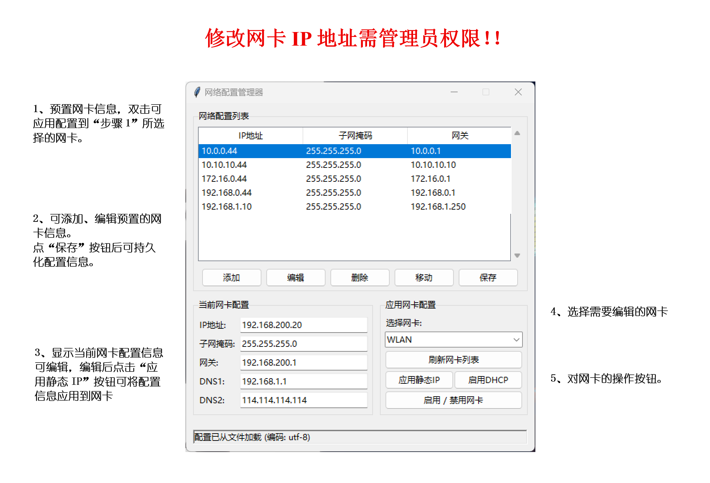

# netConfig
Simple modification of Windows network adapter information, suitable for network engineers, etc.

# 网卡配置管理器
通过简单点击，便捷的切换网卡配置。

# 安装
1. 在`Github release`下载最新版[网卡编辑器](https://github.com/Easthq/netConfig/releases/tag/v1.0.0)。
2. 下载`netConfig.zip`，解压到任意目录。
3. 将目录中的`netConfig.exe`文件右键发送到桌面快捷方式。
4. 右键桌面的快捷方式-属性-快捷方式-高级-用管理员方式启动（或属性-兼容性-以管理员身份运行）。
5. 之后可双击管理员运行此程序

# 使用方法

## 编辑预置网卡信息
* 通过中间的增删改按钮，可对预置的网卡信息进行增删改。
* 点击移动按钮，可对网卡进行排序。
* 最后一定要点保存，持久化网卡配置信息。  

***也可以通过软件目录中的`network_configs.json`文件以json格式进行编辑***

## 应用网卡配置
1. 通过下拉框，选择要配置的网卡
2. 在`网卡配置列表`中选择配置，双击即可应用
3. 或在当前网卡配置中编辑配置信息，点击`应用静态IP`，可将配置应用到当前网卡
