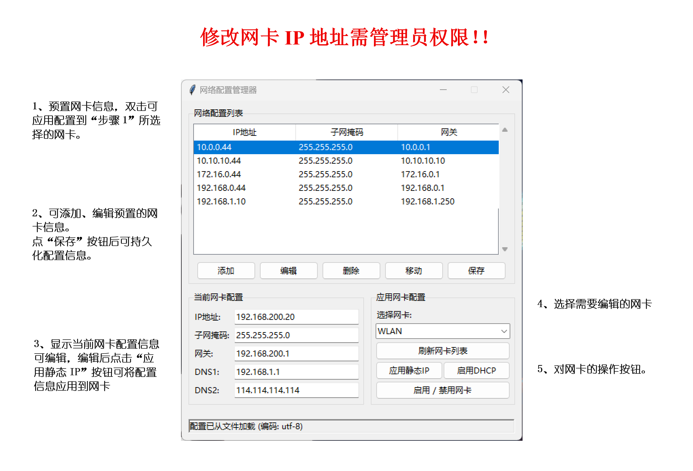

# netConfig
Simple modification of Windows network adapter information, suitable for network engineers, etc.

# 网络配置管理器
通过简单点击，便捷的切换网卡配置。

可将Releases打包的`netConfig.exe`超链接放在桌面或其他目录，对超链接授予管理员权限（右键 - 属性 - 兼容性 - 以管理员身份运行），之后双击即可管理员权限运行。

解压后有`network_configs.json`是json格式的配置文件，为预置网卡信息的内容。

手动添加“预置网卡信息”后，点击保存可更新配置文件。
